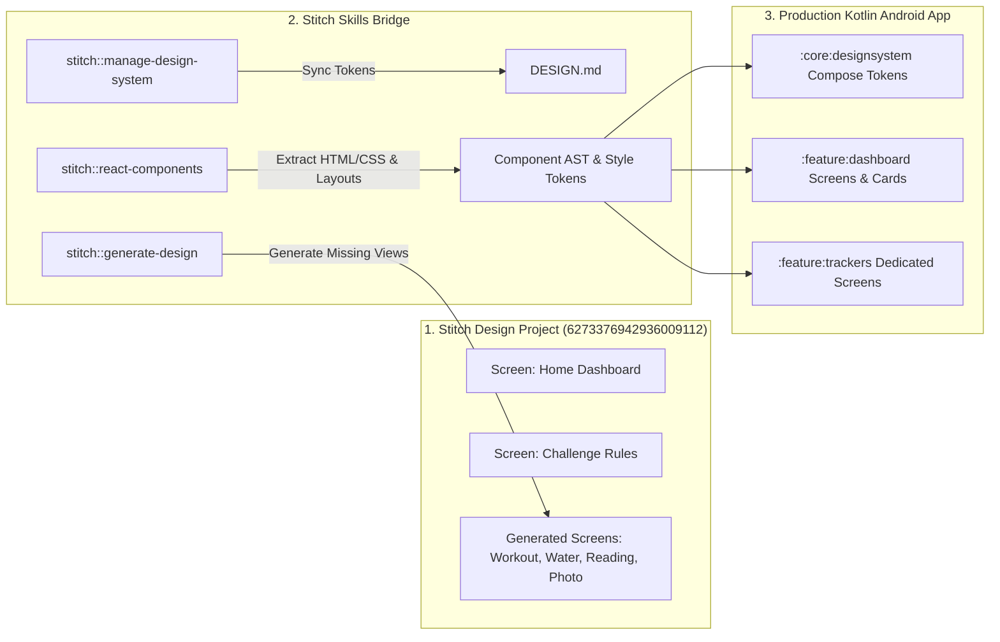

# Design System: Ascend 75 (Zenith Fitness & Growth)
**Stitch Project ID:** `6273376942936009112`  
**Target Platform:** Android (Material 3 + Jetpack Compose) / Mobile Web  
**Visual Style:** Glassmorphism + Modern Executive Minimalism  

---

## 1. Visual Theme & Atmosphere
The design system establishes a high-end, calm, executive personal-development sanctuary. It rejects frantic fitness neon, cartoon gamification, and toxic streak shaming in favor of:
- **Atmosphere**: Grounded, motivating, focused, and serene. Bridges disciplined athletic rigor with mindful personal mastery.
- **Visual Style**: Translucent dark slate surfaces, diffuse ambient glows, refined sans typography, and generous tactile rounded cards.
- **Lighting Model**: Layered glassmorphism over an absolute midnight canvas (`#0f131c`), accented with warm champagne bronze/amber (`#D4AF37`) and subtle electric cyan (`#38bdf8`).

---

## 2. Color Palette & Roles

| Token Name | Hex Code | Descriptive Character | Functional Role in App |
| :--- | :--- | :--- | :--- |
| `surface` / `background` | `#0f131c` | Obsidian Midnight | Base screen canvas; reduces cognitive load and saves OLED battery |
| `surface-container-lowest` | `#0a0e17` | Deep Void | Inset areas, sunken fields, bottom navigation background |
| `surface-container-low` | `#181b25` | Dark Charcoal Slate | Base card background under resting state |
| `surface-container` | `#1c1f29` | Elevated Slate Glass | Standard task cards, reading log panels, habit containers |
| `surface-container-high` | `#262a34` | Frosted Highlight | Active cards, elevated sheets, dropdown menus |
| `surface-container-highest` | `#31353f` | Soft Grey Slate | Dividers, chip backgrounds, disabled state containers |
| `primary` | `#f2ca50` | Vibrant Champagne Gold | Active hero indicators, completed streaks, key metrics |
| `primary-container` | `#d4af37` | Warm Muted Bronze | Primary CTA button fill, active selection checkmark, glow bloom |
| `secondary` | `#7bd0ff` | Crisp Sky Cyan | Secondary indicators, outdoor workout tags, water progress link |
| `secondary-container` | `#00a6e0` | Electric Azure | Quick-log buttons, secondary progress highlights |
| `tertiary` | `#c3cee6` | Muted Ice Slate | Metadata labels, subtle graph grids, secondary metrics |
| `on-surface` | `#dfe2ef` | Warm Off-White | High-contrast body text, screen titles, primary numbers |
| `on-surface-variant` | `#d0c5af` | Muted Sand / Grey | Secondary labels, timestamp captions, instructions |
| `outline` | `#99907c` | Subdued Bronze Border | Border outlines for inactive cards, ghost buttons |
| `outline-variant` | `#4d4635` | Ultra-thin Ghost Border | Subtle dividers (`rgba(255,255,255,0.06)`) between list rows |
| `error` | `#ffb4ab` | Coral Warning | Overtraining alerts, excessive water rate warnings, reset alerts |

---

## 3. Typography Rules

Powered exclusively by **Plus Jakarta Sans** (with fallback to Android system Roboto/Inter). Constrained strictly to 400 (Regular), 500 (Medium), and 600 (SemiBold) weights to preserve visual calmness:

- **Headline Large (`headline-lg`)**: 32px / 40px line-height, Weight 600, Tracking `-0.02em`. Used for Day Counter (*"Day 18 of 75"*).
- **Headline Medium (`headline-md`)**: 24px / 32px line-height, Weight 600, Tracking `-0.01em`. Used for Screen Titles (*"Ascend 75"*, *"Today's Protocol"*).
- **Headline Small (`headline-sm`)**: 18px / 24px line-height, Weight 500. Used for Card Titles (*"Workout 1: Outdoor"*).
- **Body Large (`body-lg`)**: 16px / 24px line-height, Weight 400. Used for Science Card educational explanations.
- **Body Medium (`body-md`)**: 14px / 20px line-height, Weight 400. Used for Task instructions and descriptions.
- **Body Small (`body-sm`)**: 12px / 16px line-height, Weight 400. Used for timestamps, units, and secondary notes.
- **Label Large (`label-lg`)**: 14px / 20px line-height, Weight 500. Used for Primary Button text and action chips.
- **Label Medium (`label-md`)**: 12px / 16px line-height, Weight 500. Used for Badge status pills (*"In Progress"*, *"Outdoor"*).
- **Label Small (`label-sm`)**: 10px / 14px line-height, Weight 600, Tracking `+0.05em`. Used for Category tags (*"CIRCADIAN"*, *"RECOVERY"*).

---

## 4. Stitch Project Assets & Screen Inventory

### Existing Screens in Stitch Project (`6273376942936009112`):
1. **Screen 1: Ascend 75 - Home Dashboard**
   - **Screen ID**: `bf1e6eee3e30454ebf6d3b0d212068bf`
   - **Dimensions**: `780 x 2610` (Mobile viewport)
   - **Key Layout Elements**:
     - Circular multi-segment progress ring showing overall day completion.
     - Day Counter header (*"Day 18 of 75"*) with streak flame indicator.
     - Six primary habit cards with checkmarks: Diet, Workout 1 (Outdoor), Workout 2, Water (3.8L), Reading (10 pages), Progress Photo.
     - Daily quote / educational insight preview card.
     - Bottom navigation bar with glassmorphic backdrop.
   - **HTML Asset**: Available via Stitch MCP `get_screen`
   - **Screenshot Asset**: High-resolution reference available via Stitch MCP `get_screen`
2. **Screen 2: Ascend 75 - Challenge & Rules**
   - **Screen ID**: `1152afa25c2e4f5abad6a2a8daf01c86`
   - **Dimensions**: `780 x 3392` (Mobile viewport)
   - **Key Layout Elements**:
     - Mode selection cards (Strict 75 vs Flexible 75 vs 75 Soft).
     - Individual rule breakdown cards with icon headers, guidelines, and safety warnings.
     - Reset policy explanation with empathetic messaging.
   - **HTML Asset**: Available via Stitch MCP `get_screen`
3. **Design System Board Asset**:
   - Asset ID: `assets/1021ec517def45b9b382dd5dc9eb6197`

---

## 5. Component Specifications & Compose/React Translation

### 5.1 `AscendButton` (Primary & Secondary Actions)
- **Primary**: Pill-shaped (`rounded-full`), solid warm bronze fill (`#d4af37`), dark contrast text (`#3c2f00`), subtle scale micro-interaction (`0.98` on press).
- **Secondary**: Translucent dark container (`#1c1f29`), ghost border (`#99907c` at 20% opacity), warm off-white text (`#dfe2ef`).
- **Compose Implementation**:
  ```kotlin
  @Composable
  fun AscendButton(
      text: String,
      onClick: () -> Unit,
      modifier: Modifier = Modifier,
      variant: ButtonVariant = ButtonVariant.Primary,
      enabled: Boolean = true
  )
  ```

### 5.2 `GlassCard` (Standard Elevated Container)
- **Geometry**: 16px (`1rem`) or 24px (`1.5rem`) corner radius.
- **Surface**: Background `#181b25` (resting) or `#1c1f29` (elevated) with 0.85 opacity.
- **Border**: 1dp hairline border with color `Color.White.copy(alpha = 0.08f)`.
- **Shadow**: Diffuse ambient shadow without sharp drop-off; optional low-opacity bronze bloom behind active items.
- **Compose Implementation**:
  ```kotlin
  @Composable
  fun GlassCard(
      modifier: Modifier = Modifier,
      onClick: (() -> Unit)? = null,
      content: @Composable ColumnScope.() -> Unit
  )
  ```

### 5.3 `AscendProgressRing` (Hero Completion Indicator)
- **Geometry**: Concentric circular track, stroke width 12dp, cap style `StrokeCap.Round`.
- **Background Track**: `#262a34` (Surface Container High).
- **Active Progress**: Linear sweep gradient from `#d4af37` (Bronze) to `#f2ca50` (Champagne Gold).
- **Animation**: Animated float with spring damping over 750ms.

### 5.4 `HabitCheckCard` (Daily Task Item)
- **Layout**: Leading status icon / custom checkbox, title and secondary metadata column, trailing action chevron or quick-complete trigger.
- **Completed State**: Card shifts to subtle `#181b25`, title strikes through with muted bronze checkmark, gentle haptic click (`HapticFeedbackType.LongPress`).

---

## 6. How to Leverage Stitch Skills During Development

When we proceed to build the application, development will follow a structured bridge between Stitch designs and production Kotlin/Compose code using the available Stitch skills.



### 6.1 Skill Runbook by Development Phase

#### Phase A: Token Synchronization (`stitch::manage-design-system` & `design-md`)
- **Action**: When visual styles or tokens in the Stitch project are updated, use `get_project` and `design-md` to update `DESIGN.md`.
- **Compose Rule**: In `:core:designsystem`, map tokens directly to Kotlin `ColorScheme` and `Typography` objects. No hardcoded hex values in UI screens.

#### Phase B: New Screen Generation (`stitch::generate-design`)
- When screens outside the initial 2 screens are needed (e.g., *Onboarding Step 3*, *Active Workout Countdown*, *Progress Photo Biometric Vault*, *Science Card Detail*):
  1. Call `stitch::generate-design` or MCP `generate_screen_from_text` with project ID `6273376942936009112`.
  2. Provide the prompt enhanced with the `Zenith Fitness & Growth` design system tokens from this file.
  3. Stitch generates the high-fidelity visual and HTML structure directly in the project.

#### Phase C: Layout Inspection & Translation (`stitch::react-components`)
- **Inspection**: Call `get_screen` to fetch `screenshot.downloadUrl` and `htmlCode.downloadUrl`.
- **Translation**: Inspect the Tailwind CSS structure (flexbox, grid, glassmorphic styling, padding) and translate directly into modular Jetpack Compose composables (`Column`, `Row`, `Box`, `Surface`, `Canvas`).
- **Validation**: Ensure all Compose components accept a `Modifier`, expose state hoisting (lambdas for events), and use tokens from `DESIGN.md`.

#### Phase D: Uploading Mockups or Iterations (`stitch::upload-to-stitch` / `code-to-design`)
- If custom UI variations are created locally, use `stitch::upload-to-stitch` to push screenshots or HTML mockups back into Stitch project `6273376942936009112` for visual cataloging.

---

## 7. Consistency Checklist for Code Generation
Every UI screen built during development MUST pass this checklist:
- [ ] Uses background `#0f131c` and card container `#181b25` / `#1c1f29`.
- [ ] Primary buttons use `#d4af37` fill with dark text `#3c2f00`.
- [ ] Typography uses `Plus Jakarta Sans` with designated sizes and weights.
- [ ] Corner radii follow the 8px (`rounded-md`), 16px (`rounded-lg`), or 24px (`rounded-xl`) scale.
- [ ] No hardcoded colors; all colors reference `MaterialTheme.colorScheme` or `AscendPalette`.
- [ ] Interactive elements provide tactile haptic feedback.
- [ ] Tested for minimum touch target sizes (>= 48x48dp) and WCAG AA contrast.
