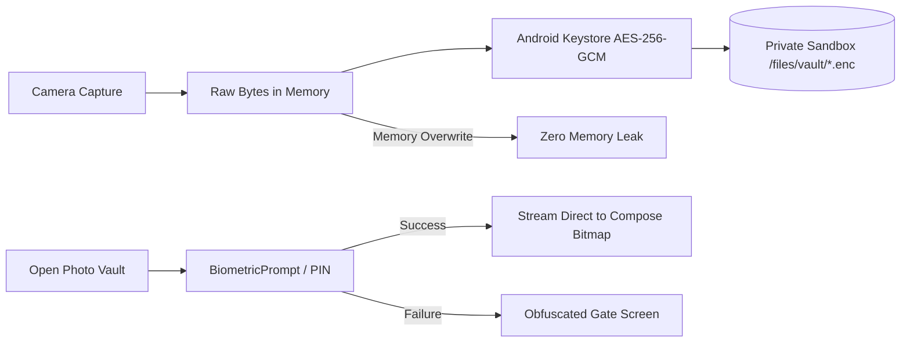

# Ascend 75 — Discipline Operating System for Android

<div align="center">

-34D399?style=for-the-badge&logo=android&logoColor=white)


**An offline-first, executive-grade Android discipline and habit-transformation platform engineered around a structured 75-day personal challenge.**

[Features](#-core-pillars--features) • [Architecture](#-android-architecture--modular-design) • [Design System](#-design-system-zenith-fitness--growth) • [Security & Privacy](#-hardware-security--photo-vault) • [Building & Testing](#-building--testing) • [Download APK](#-testing--apk-downloads)

</div>

---

## ⚡ Executive Summary

**Ascend 75** rejects superficial gamification, toxic shaming, and intrusive cloud ad-trackers. Instead, it provides a calm, science-informed, privacy-first companion combining:
- **Customizable 75-Day Challenge Modes**: Strict 75, Flexible 75, 75 Soft, and Custom modes.
- **Intelligent Day Boundaries**: User-configurable sleep cutoff (default 3:00 AM) eliminating artificial midnight failures.
- **Encrypted Biometric Photo Vault**: Progress photos protected by Android Keystore hardware-backed AES-256-GCM encryption with zero leakage to public galleries.
- **Pre-Seeded 75-Day Science Curriculum**: Peer-reviewed educational cards derived from circadian biology, sleep architecture, dopamine dynamics, and implementation intentions with primary PubMed/DOI citations.
- **Sovereign Data Sovereignty**: 100% offline Room persistence with single-tap cryptographic zero-fill data erasure.
- **One Information Architecture, Two Clients**: Today · Trackers · Learn · Vault · More across both the Android app and the bundled web prototype.

---

## 🛡️ Core Pillars & Features

### 1. Challenge Modes & Empathetic Accountability
| Mode | Daily Requirements | Failure Policy |
| :--- | :--- | :--- |
| **Strict 75** | Two 45m workouts (1 outdoor), 3.8L water, 10 pages reading, strict diet, daily progress photo. | Incomplete day past sleep cutoff prompts an **Empathetic Reflection** modal, safely archives attempt history, and prompts restart or mode shift. |
| **Flexible 75** | Identical rigor to Strict 75 with customizable sleep cutoff up to 4:00 AM. | Incomplete days record reflection lessons and advance without resetting the cumulative streak. |
| **75 Soft** | One 45m workout daily, active recovery, 3.0L water, 10 pages reading, mindful balanced nutrition. | Sustainable gentle consistency for habit builders and active recovery cycles. |
| **Custom** | User-selected habits and thresholds. | Flexible personal experimentation. |

### 2. Specialized Tracking Engines
- **Dual 45-Minute Workout Timer**: Ongoing Android Foreground Service with persistent chronometer notification, CPU wake-lock safeguards, indoor/outdoor classification, minimum duration guardrails (<45 min alert), and a **3-hour physiological rest separation advisory**.
- **Smart Hydration Engine**: Quick-add increments (+250ml, +500ml, +750ml, +1000ml) with an hourly pacing visualizer and an automated **Hyponatremia Clinical Safety Warning** (>1,200 ml within a 60-minute window).
- **Cognitive Reading Tracker**: 10-page minimum session validation, active reading timer, and qualitative key takeaway reflection journal.
- **Progress Photo Vault**: In-app custom capture pipeline storing encrypted `.enc` files directly in sandbox with an interactive **Before-and-After split-slider comparison**.

### 3. Science-Backed Educational Library
- Pre-seeded offline catalog of **75 evidence-informed science cards**.
- Five scientific domains: `CIRCADIAN`, `FOCUS`, `DOPAMINE`, `RECOVERY`, and `HABITS`.
- Progressive daily unlock (Day $N$ unlocks Card $N$) with category filtering, keyword search, and bookmarking.

### 4. Hybrid Intelligent Notifications
- Android Notification Channels: `channel_briefing`, `channel_reminders`, `channel_workout_timer`, and `channel_milestones`.
- Quiet hours suppression (e.g. 10:00 PM to 7:00 AM) and **automatic cancellation of pending evening reminders** once 100% of daily habits are checked off.
- Resilient to device reboots (`BOOT_COMPLETED`) and daylight saving / timezone changes (`TIMEZONE_CHANGED`).

---

## 🏛️ Android Architecture & Modular Design

Built strictly adhering to modern Android Jetpack guidelines, Clean Architecture, and Unidirectional Data Flow (MVI/MVVM):

```
Ascend75/
├── app/                               # Root application, Hilt setup, navigation shell
├── core/
│   ├── common/                        # ChallengeRulesEngine, DayBoundaryEvaluator, ChallengeMode
│   ├── designsystem/                  # Material 3 theme, typography, shapes, Stitch tokens, bottom bar
│   ├── database/                      # Room database, entities, DAOs, ScienceCardSeeder
│   ├── datastore/                     # Jetpack Preferences DataStore for local state & cutoff schedules
│   ├── crypto/                        # Android Keystore manager, VaultFileStorage, BiometricAuthHelper
│   └── notifications/                 # Channels, WorkManager worker, AlarmManager scheduler, receivers
└── feature/
    ├── onboarding/                    # 6-step questionnaire, medical disclaimer, cutoff config, mode selection
    ├── dashboard/                     # Progress ring, habit checklist, Trackers hub, day/streak engine
    ├── workout/                       # Foreground timer service, workout screen, rest separation warning
    ├── water/                         # Water gauge, quick add, hyponatremia alert dialog
    ├── reading/                       # Book log, page interval counter, session timer, reflection notes
    ├── photos/                        # Biometric lock gate, encrypted capture, split comparison
    ├── learn/                         # 75-day science library, card detail, DOI links, bookmarks
    └── settings/                      # Export, sleep cutoff, protocol mode, cryptographic zero-wipe
```

### Navigation & Information Architecture

Both clients expose the same five destinations, rendered by a fixed bottom bar
(`AscendBottomBar` on Android, `AscendTabBar` on web):

| Tab | Destinations it owns |
| :--- | :--- |
| **Today** | Dashboard, science-card highlight, daily guardrails checklist |
| **Trackers** | Trackers hub, Workout timer, Hydration, Reading |
| **Learn** | 75-day curriculum with in-place card detail and bookmarking |
| **Vault** | Biometric-gated encrypted progress photos |
| **More** | Sleep cutoff, protocol mode, JSON export, data wipe, about/disclaimer |

Pressing system back from a non-Today tab returns to Today before exiting. Deep links of the form
`ascend75://task/<taskId>` (used by the notification actions) resolve the task and open its tracker.

### Web Prototype (`web/`)

A presentational React 19 + Vite prototype mirrors the same five tabs and design tokens for review outside a
device. It keeps state in memory — no backend, no persistence — and is a companion to, not a replacement for,
the Android app. See [`web/README.md`](web/README.md).

---

## 🎨 Design System ("Zenith Fitness & Growth")

Directly integrated with Google Stitch Project `6273376942936009112` and [`DESIGN.md`](file:///D:/Ascend75/DESIGN.md):
- **Obsidian Dark Canvas**: `#0F131C` base surface with calibrated elevations (`#181B25`, `#1C1F29`, `#262A34`).
- **Brand Accents**: Champagne Gold (`#F2CA50`), Warm Muted Bronze (`#D4AF37`), Sky Cyan (`#7BD0FF`), Electric Azure (`#00A6E0`).
- **Typography Scale**: Editorial and high-contrast hierarchy using *Plus Jakarta Sans*.
- **Tactile Components**: `AscendButton` (48dp pill), `GlassCard` (translucent hairline border), `AscendProgressRing` (multi-segment animated sweep), and `HabitCheckCard` (haptic checkoff toggle).
- **Accessibility**: Enforces WCAG AA (4.5:1) and AAA (7:0:1) contrast compliance across all interactive surfaces.

---

## 🔒 Hardware Security & Photo Vault



1. **Zero Public Gallery Leakage**: Photographs are never sent to `MediaStore` or external storage.
2. **Hardware Key Binding**: Master keys reside in `AndroidKeyStore` with GCM authentication tags.
3. **Cryptographic Zero-Wipe**: "Delete All Data" performs multi-pass zero-filling over encrypted photo files before unlinking from the file system.

---

## 🛠️ Building & Testing

### Prerequisites
- JDK 17
- Android SDK 34 (Android 14)
- Gradle 8.9+

### Build Debug APK Locally
```bash
./gradlew assembleDebug
```
The compiled APK will be located at:
```
app/build/outputs/apk/debug/app-debug.apk
```

### Run Automated Unit & Integration Tests
```bash
./gradlew test
```
The suite runs on the JVM (Robolectric where a real `Context` or in-memory Room database is needed) and covers
the rules engine, day-boundary evaluation, `DailyProtocolRepository` day advancement and streak derivation,
hydration rate limiting and restore, the reading 10-page gate and session timer, vault file framing,
photo-vault capture and vault gating, quiet-hours suppression, the science-card asset, and an onboarding → day-2
journey over the real schema.

---

## 📦 Testing & APK Downloads

Every push to `main` triggers our GitHub Actions CI/CD pipeline, which compiles the application and generates a downloadable debug APK:

1. Navigate to the [Releases](https://github.com/RohannShetty/Ascend75/releases) tab.
2. Download `app-debug.apk` under the latest **v1.0.0 Preview Build**.
3. Install the APK on any device running Android 8.0+ (API 26+) or in Android Studio Emulator.

---

## 📄 License & Medical Disclaimer

**Health Notice**: Ascend 75 is an educational discipline and habit development tool. It is not a medical device. Always consult a qualified physician prior to initiating strenuous fitness regimens or major hydration shifts.
